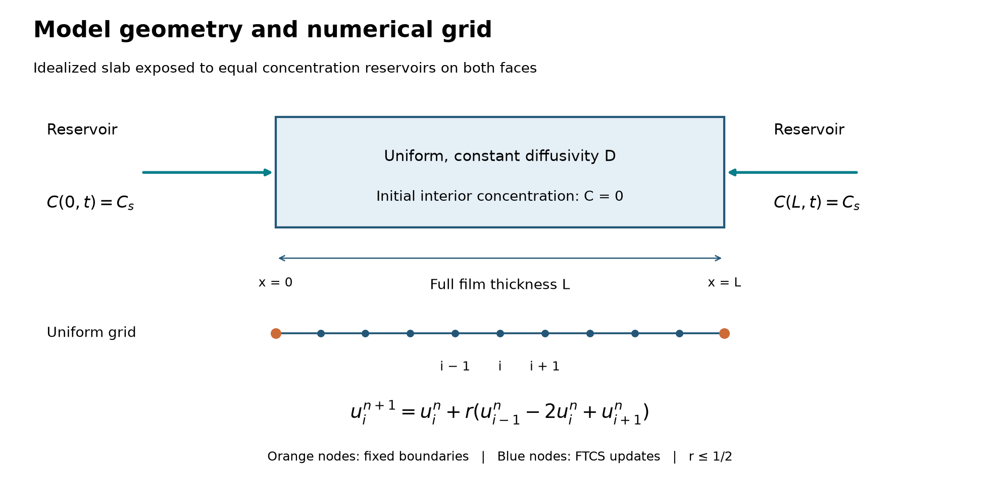

# Diffusion into a thin film

A Python study of how film thickness and diffusivity affect the time needed for a species to enter a film. The model solves Fick's second law in one dimension, compares explicit FTCS and Crank–Nicolson time stepping, and checks the results against an analytical series.

**Computational study:** the plots and CSV files are simulated. No experimental measurements or material-specific validation are claimed.


## Start here

- [Model and assumptions](docs/METHOD.md): geometry, boundary conditions, equations, and numerical method.
- [Computed results](results/REPORT.md): concentration profiles, uptake, numerical error, and thickness scaling.
- [Time-stepping comparison](results/METHOD_COMPARISON.md): FTCS and Crank–Nicolson accuracy for the same physical model.
- [Solver](diffusion.py): finite differences, analytical solution, and unit conversion.
- [Base study script](run_study.py) and [comparison script](compare_methods.py): generate the figures, CSV files, and reports.
- [Verification tests](tests/): analytical agreement, physical bounds, symmetry, convergence, tridiagonal solving, and scaling.
- [Code walkthrough](docs/WALKTHROUGH.md): how to understand the calculation and try a small extension.
- [Related work](docs/RELATED_WORK.md): reviewed repositories, attribution, and the scope of the independently implemented extension.

## Run it

Python 3.14 was used for the recorded run. From the repository root:

```bash
python3 -m venv .venv
source .venv/bin/activate
python -m pip install -r requirements.txt
python -m unittest discover -s tests -v
python run_study.py
python compare_methods.py
```

On Windows, use `.venv\Scripts\activate` instead of the `source` command. The tested package versions are also recorded in `requirements-lock.txt`; use it in place of `requirements.txt` to reproduce that environment. The script uses a non-interactive plotting backend, so a display is not required.

To keep a separate set of generated outputs:

```bash
python run_study.py --output results-check
python compare_methods.py --output results-check
```

The study settings are explicit near the top of `main()` in `run_study.py`: output times, 201 profile nodes, the grids for convergence, and the illustrative dimensional parameters. `diffusion.py` can be imported to run other grids or output times.

## The setup



Both faces of a uniform slab are held at the same surface concentration; its interior initially contains none of the diffusing species. This is an idealized model geometry. The full thickness is L, the diffusivity D is constant, and normalized time is Fo=Dt/L².

The thickness comparison uses D=10⁻¹⁴ m²/s and thicknesses of 1, 2, and 5 µm purely as illustrative scales. These numbers are not measurements or fitted properties of a named material. The solver omits chemical reactions, microstructure, and surface-transfer resistance.

## Development

This new portfolio project was prepared with AI assistance. All results are reproducible calculations from the supplied code; see the [development and data-origin note](docs/DEVELOPMENT.md).

Background references and the analytical derivation are included in the [method report](docs/METHOD.md).
