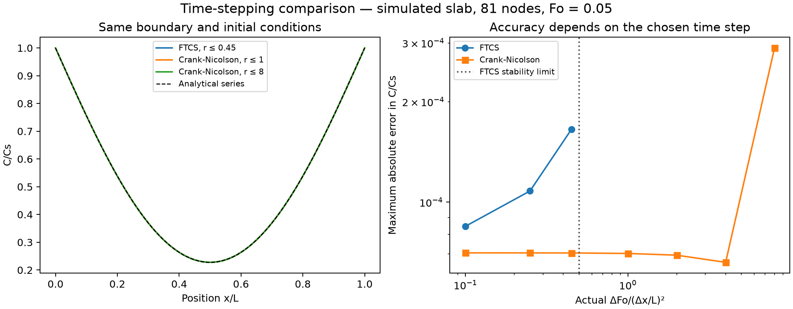

# Explicit and implicit time stepping

Generated by `python compare_methods.py`. The same idealized slab is solved at Fo=0.05 with 81 nodes using explicit FTCS and Crank–Nicolson (CN).

| Method | Maximum r | Actual r | Steps | Max. absolute error |
| --- | ---: | ---: | ---: | ---: |
| FTCS | 0.1 | 0.100000 | 3200 | 8.466e-05 |
| FTCS | 0.25 | 0.250000 | 1280 | 1.080e-04 |
| FTCS | 0.45 | 0.449438 | 712 | 1.652e-04 |
| Crank-Nicolson | 0.1 | 0.100000 | 3200 | 7.049e-05 |
| Crank-Nicolson | 0.25 | 0.250000 | 1280 | 7.047e-05 |
| Crank-Nicolson | 0.45 | 0.449438 | 712 | 7.043e-05 |
| Crank-Nicolson | 1 | 1.000000 | 320 | 7.021e-05 |
| Crank-Nicolson | 2 | 2.000000 | 160 | 6.937e-05 |
| Crank-Nicolson | 4 | 4.000000 | 80 | 6.603e-05 |
| Crank-Nicolson | 8 | 8.000000 | 40 | 2.898e-04 |

FTCS requires r≤0.5 for stability. CN is linearly stable for larger ratios, but this does not guarantee accuracy or non-negative, monotone profiles. A sudden surface-concentration jump can excite oscillations with coarse CN steps. The tests include a deliberately coarse example that overshoots the physical concentration range, rather than clipping it.

The error includes spatial discretization, time stepping, and the initial boundary discontinuity. Error cancellation can make it non-monotonic in the step size. The table is not a general claim that either method is always more accurate or faster. Step counts are reported; no execution-speed benchmark is claimed.

The standard CN method was independently implemented here for diffusion. AbhinavPJ's quantum simulation was a topic reference; no source code, notebook, figure, or dataset was copied. See [related work](../docs/RELATED_WORK.md) and the [method report](../docs/METHOD.md).
