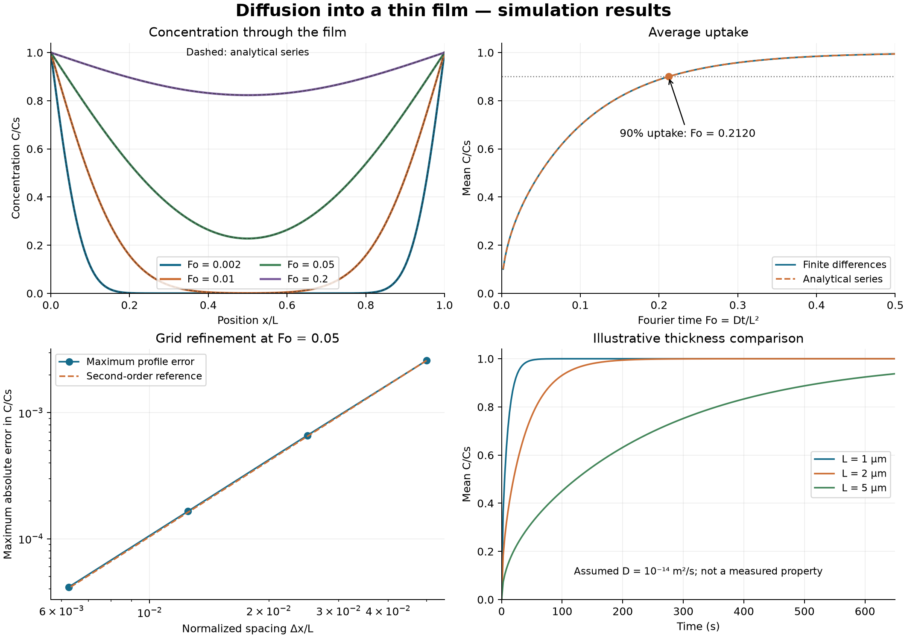

# Computed results

Generated by `python run_study.py`. Every number and plot on this page comes from the stated model, not an experiment.

## Numerical checks

The 201-node FTCS solution is compared with a 512-term analytical series. The largest absolute concentration error over the four saved profiles is **7.243e-04** in normalized concentration units. This covers Fo = 0.002, 0.01, 0.05, and 0.2, not arbitrary times or boundary conditions.

At Fo = 0.05, doubling the number of intervals produces observed convergence orders of **1.974, 1.999, 1.998**. The time step decreases with the square of grid spacing, so the first-order time error also decreases quadratically with spacing. This check measures discretization accuracy against the same mathematical model; it does not validate a real material.

## Thickness study

The analytical solution reaches 90% mean uptake at **Fo = 0.212021**. With an illustrative D = 1e-14 m²/s:

| Film thickness | Time to 90% uptake |
| --- | --- |
| 1 µm | 21.202 s |
| 2 µm | 84.809 s |
| 5 µm | 530.053 s |

At fixed diffusivity, doubling thickness multiplies the time to a given uptake by four because t = Fo L²/D. This is a consequence of the model's scaling, not an experimentally discovered relation. No specific film composition or temperature is assigned to the illustrative diffusivity.

## Files and interpretation

- `profiles.csv`: position, numerical concentration, and series concentration at four times.
- `uptake.csv`: numerical and analytical mean uptake over time.
- `grid_convergence.csv`: maximum error for 21, 41, 81, and 161 nodes.
- `summary.json`: parameters, numerical checks, and software versions.
- `model_schematic.svg`: idealized slab geometry and finite-difference stencil.

There are no repeats, uncertainty bars, or fitted material parameters because these outputs are deterministic model calculations. The model omits reactions, microstructure, concentration-dependent diffusivity, and finite surface-transfer resistance. See the [method](../docs/METHOD.md) and [development note](../docs/DEVELOPMENT.md).
